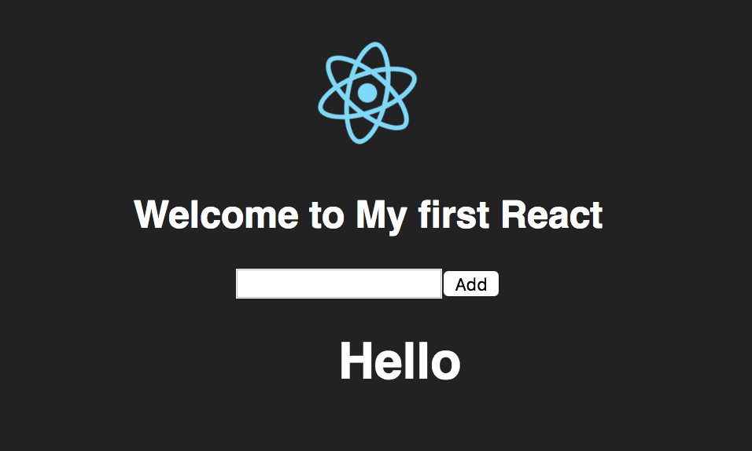
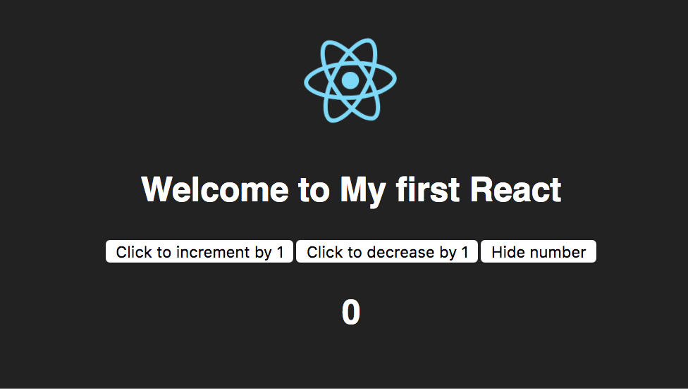
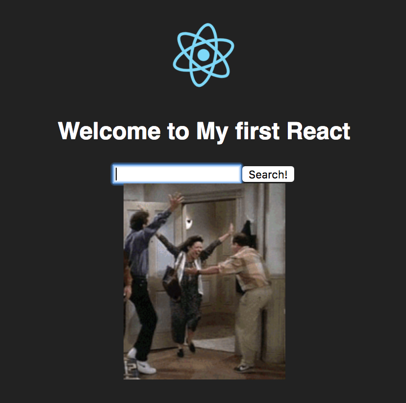

# MyComponent1
## To do List
input your item and display

# MyComponent 2
## Increment and decrement
every click should increment or decrement by 1 numeric value and should be able to hide output

# MyComponent 3
## display gifs with simple api
upon search, call an api and display the gif
